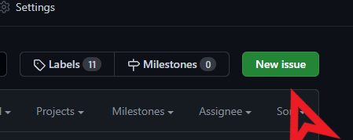
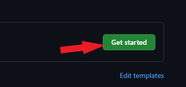
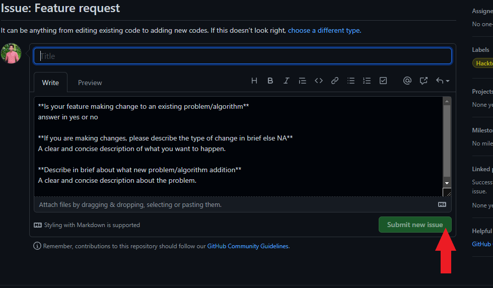
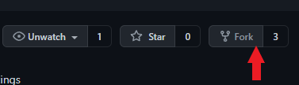
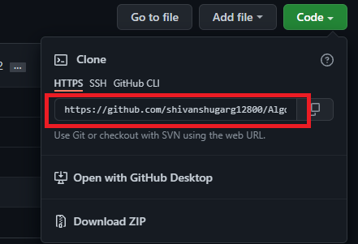
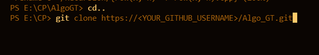
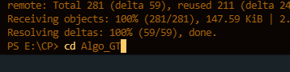
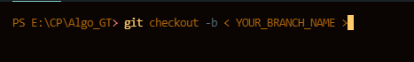

# Contributing Guidelines

### Follow the guidelines on how to create issues, Fork a repo, makes changes, and ask the maintainers to review and merge it.

## Creating issue

Issues can be used to keep track of all the new problems that are to be added and are also helpful in comparing with the existing codebase.

#### DO NOT MAKE PR WITHOUT CREATING AN ISSUE

1. Click on the issues tab. 
   

2. Click on new issue if any of the already present issues do not interest you. 
   

3. Click on Get started. 
   

4. Enter name of the issue and submit. 
   

#### Wait for the issue to be assigned to you

## Making a PULL REQUEST

Pull requests are to be made after an issue has been assigned to you. 
These Guidelines will teach how to contribute to any other people's repository in general and not limited to this repository.

1. <b>Fork</b> the repository.  Forking the repository makes a local copy of the parent repository in your Github account. 

2. Now move to your forked repository in your account. Click on the <b>Code</b> button in green and copy the link to the repository. 
   

3. Now move to your code editor and open terminal. 
   Move to your desired path in the terminal and enter this command. 
   

Don't forget, you have to copy from your own forked repository so that it contains your username in the code link.

4. Now cd to the folder of the repository. 
   

5. Now you have to create a new branch 
   Switch to Development Branch. Never develop on Master Branch. Push in the command:  <code>git checkout < YOURUSERNAME ></code>
    
   
   

6. Start Coding. Make commits with proper commit messages.  
   After you have made changes/ added new files
   write these commands - 
   <code> git add .</code> 
   <code> git commit -m "commit message"</code> 

#### You have committed your changes in the local machine, but there might be possibility that someone before you have made changes and even made PR before you.   So it is advised to Pull code from the master branch to your local branch or more specifically keep your Fork in sync with repository 

for that write this command after commiting- 
<code> git pull</code> 
After that you can go on and push your changes 
<code> git push</code> 

7.
